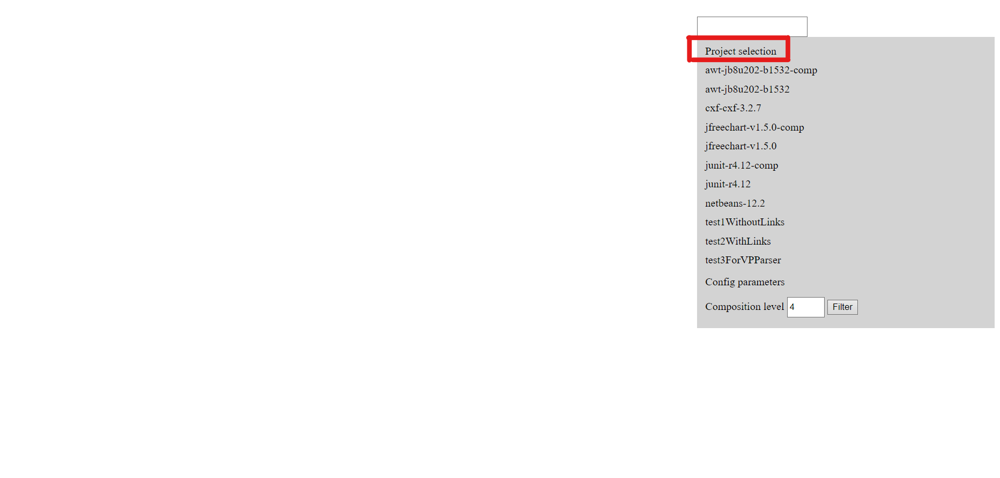
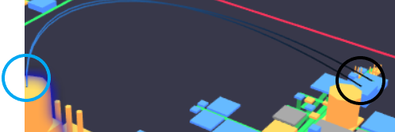
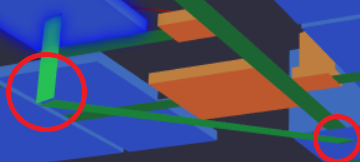
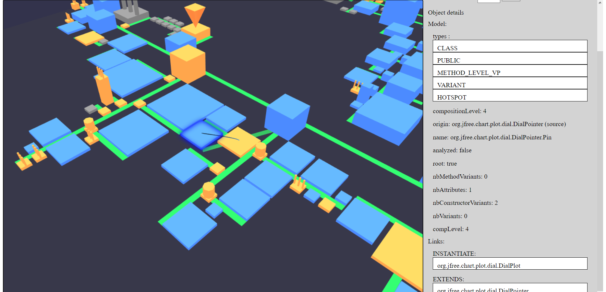
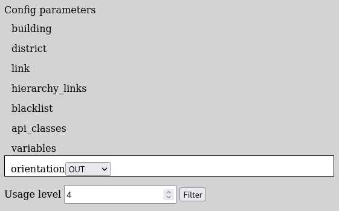
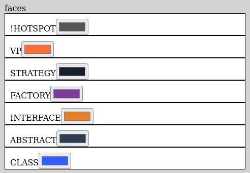
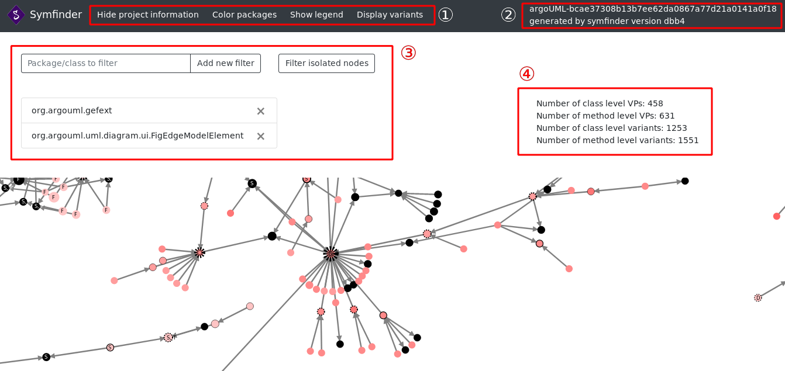

# VariCity [](https://github.com/DeathStar3-projects/varicity-config/actions/workflows/prepare.yml)

VariCity is a 3D visualization relying on the city metaphor to display zones of high density of variability implementations in a single system.
The city is built by creating building, corresponding to classes, and streets, grouping every class linked to the street's starting building.

In order to build the city, VariCity parses the JSON files produced by symfinder and produces a graph composed by classes and their links. The starting points of this graph are API classes, defined by the user.
API classes are the first buildings placed on the "root" street, and classes linked to them are placed in their corresponding streets.
Links used to produce this hierarchy can be configured, depending on their type (inheritance or usage), and orientation (see the [Configuration](#configuration) section).

In order to use VariCity to visualize your project, you need to first analyse it using the symfinder toolchain.
[Go to symfinder's documentation](#symfinder)

Pre-generated JSON files resulting from the analysis of 10 projects by symfinder are provided in the `pre_generated_visualizations.zip` archive and ready to be used by VariCity.

## Technical Requirements

- Docker
  - Instructions to install Docker are available [here](https://docs.docker.com/get-docker/).
- Docker Compose
  - Instructions to install Docker Compose are available [here](https://docs.docker.com/compose/install/#install-compose).

**Note:** You need to have a system running on either
- GNU/Linux
- Windows 10 64bit: Pro, Enterprise or Education (Build 15063 or later)
- macOS Sierra 10.12 or newer on a hardware from at least 2010

**Note:** If you run symfinder on a Windows system, symfinder must be placed somewhere on your `C:` drive.

If your system does not match any of the requirements above, you must install a virtual machine.
[This tutorial](https://www.wikihow.com/Install-Ubuntu-on-VirtualBox) may help you.

**Note:** By default, on a GNU/Linux host, Docker commands must be run using `sudo`. Two options are available for you in order to run symfinder:
- Follow [these short steps](https://docs.docker.com/install/linux/linux-postinstall/#manage-docker-as-a-non-root-user) to allow your user to call Docker commands,
- Preface the scripts calls with `sudo`.


## Running VariCity

All the scripts below are located and executed from the `varicity` directory, located at the root of the project.

*Note:* Before using VariCity, you should have a `generated_visualizations` directory (in the directory containing this README file) containing files generated by symfinder.
Such files can be obtained either:
- by running symfinder on a project of your choice (see [symfinder's documentation](#symfinder));
- by unzipping the `pre_generated_visualizations.zip` in this directory.

### Reusing the existing Docker image

The following Docker image hosted on the [Docker Hub](https://hub.docker.com/) allows to use VariCity without needing to build it.
```
deathstar3/varicity
```

Run VariCity by running


- On GNU/Linux and macOS

    ```
    ./varicity.sh
    ```

- On Windows

    ```
    varicity.bat
    ```

*Note:* As for symfinder, the Docker image is automatically downloaded by Docker with the tag `vissoft2021` if it is not found on the host system.

### Building VariCity

**This step is only needed if you edited VariCity's source code.**

You can build VariCity's Docker images by running

```
./build.sh
```

Then, run symfinder using the local images that you just built.

```
./varicity.sh --local
```


### Run without Docker

To run VariCity on your local machine, you first need to install [NodeJS](https://nodejs.org/en/). Then, go to the ```varicity``` folder at the root of the project and run ```npm install```, then ```npm start```.
Before using VariCity, make sure to copy the JSON files produced by symfinder (found in `generated_visualizations/data`) in the ```varicity/symfinder_files``` folder.

## Using VariCity

To access the visualization once VariCity is running, you need to access ```localhost:9090``` via a web browser.

### Select a project

To select the project you want to visualize, head to the side menu and click on Project selection, then on the name of your analysed project.


You will most probably have to wait for a few seconds while the file is getting parsed before the visualization actually appears on your screen.

### Exploring your city

Once the visualization is up, you can explore the city by moving the camera with the following controls:

- Left mouse button: Drag to turn the camera
- Right mouse button: Drag to move the camera
- Scroll up/down: Zoom in/out

You can use the search bar at the top of the side menu to search for a specific class and focus the camera on its corresponding building in the visualization (with autocompletion).

#### Buildings

Buildings represent classes and wear information with how they are displayed:

- Size:
  - Height: by default, the height of a building depends on the number of method variants of the class.
  - Width: by default, the width of a building depends on the number of constructor variants of the class.
- Color: the color of a building depends on the tags of its corresponding class (see the config section)
- Models: Some building may have additional features to their 3D model:
  - Design patterns:
    - Chimneys:  A building with chimneys represents a Factory class  
      
    - Dome: A building with a dome represents a Strategy class  
      
    - Inverted pyramid: A building with an inverted pyramid represents a Template class  
      
    - Sphere: A building with a sphere represents a Decorator class  
      
  - Pyramid and outline: The API classes have a pyramid and an outline added to their representation  
    


#### Links

In VariCity, you can also see relations between your classes, in different ways:

- Streets: A street is created when a VP is parsed, and all its variants are displayed next to the street.
- Aerial links: By default, inheritance links (EXTENDS and IMPLEMENTS) are displayed as aerial links. The building at the darker side is the source (subclass), and the one at the brighter side is the destination (superclass).  
    
  *On the left, the bright side of the link means that the yellow building is the super class of the blue building on the other hand, at the dark side.*
- Underground links / Underground streets: By default, an underground link between two buildings shows the DUPLICATE links, unique to VariCity and not present in the symfinder files. It means that the starting building is a variant of the target building, but could not be placed in the target's street because it had already been drawn. Thus, each building is displayed only once.
  Underground links are also oriented, and the source class is represented by the building having a vertical street underneath itself. The destination class is directly linked by the underground link.
  The depth of the vertical part depends on the difference of usage level between the two classes.  
    
  *Here, an underground street goes from the left to the right side of the image. This means that the class on the left side is also present in the district of the class on the right side.*

By clicking on a building, you can display the links leading to or coming from it, as well as detailed info on the side menu (types, attributes, links, etc.) in the "Object details" section.

  
*The highlighted building has all its links displayed*


### Configuration



In the side menu, you can change various configuration variables in the "Config parameters" submenu:

- Usage level: Change the level of usage used to display the city (default is 4).
- Orientation: Can be IN, OUT, or IN_OUT. Used to change the orientation of the links used to establish the usage level of each element.
- hierarchy_links: Contains the list of link types used to compose the graph of the city.
- api_classes: For each project, list of names of the entry point classes used as starting points to build the city.
- Building:
  - padding: will change the space between each building
  - colors:
    - faces: Contains the colors list in which the buildings should be displayed according to their tags. Every colors list in the configuration is ordered, and if a class has two of the listed tags, the first one in the list will be taken into account. Putting a ```!```before a tag name will set the color for each class that does not have the tag.
      Example (default configuration):
      
    - edges: Colors list for the outlines of the buildings (by default, there is only a black outline for the API classes).
- district:
  - padding: Space between every district (default is 0)
  - colors > faces: Colors list for the types of package (tag PACKAGE is for the root street, tag VP is for the other streets).
- link:
  - colors: Colors list for the links.
  - display:
    - air_traffic: List of tags corresponding to the links that should be displayed as aerial links.
    - underground_road: List of tags corresponding to the links that should be displayed as underground links.
- blacklist: Each class or package in this list will be excluded from visualization.
- variables: Names of the variables used to determine the height and the width of the buildings (do not change unless you know the variable names in the source code).

The default configuration is retrieved from the ```config/config.yaml``` file in the ```varicity ``` folder.
Its structure is identical to the menu displayed on the visualization.
This file can be modified at any time. However, you will need to rerun VariCity to take the changes into account.


An additional attribute in this file is `default_level`, used to determine the default usage level (default is 4).

### Configure VariCity for your project

The `api_classes` section of VariCity's configuration file (being the `config/config.yaml` file in the `varicity ` folder) allows defining default entry point classes for your project.

#### Example:

Let's suppose that you defined the following experiment in symfinder (see [Using symfinder on your project](#using-symfinder-on-your-project) section for more details on how to define a new experiment in symfinder):

```yaml
myproject:
  repositoryUrl: https://github.com/myusername/project1
  sourcePackage: .
  tagIds:
    - customtag
```

In the `api_classes` section of VariCity's configuration file, you may add a new entry for your project, having for name the pattern `<experiment_name>_<experiment_tag_or_commit>`.

```yaml
api_classes:
  myproject-customtag:
    - "my.first.EntryPointClass"
    - "my.second.EntryPointClass"
```

This allows you to create different pre-configurations for every commit / tag of a same project.

#### Example:

Let's suppose that you defined the following experiment in symfinder:

```yaml
myproject:
  repositoryUrl: https://github.com/myusername/project1
  sourcePackage: .
  tagIds:
    - customtag1
    - customtag2
  commitIds:
    - customcommit 
```

In the `api_classes` section of VariCity's configuration file, you can define entries wih the following names:

```yaml
api_classes:
  myproject-customtag1:
    - "my.first.EntryPointClass"
    - "my.second.EntryPointClass"
  myproject-customtag2:
    - "my.first.EntryPointClass"
  myproject-customcommit:
    - "my.third.EntryPointClass"
```

# symfinder

symfinder is a toolchain parsing a single Java codebase to identify potential variability implementations.
The output of symfinder consists in JSON files containing information on the presence of variability implementations in the analysed codebase (e.g. if a class has been identified as a variation point or a variant, number of variants of an identified variation point…).

## Using symfinder

*Note:* All the commands given in this section are executed from the directory where this README file is located. 

### Reusing the existing Docker images

The following Docker images hosted on the [Docker Hub](https://hub.docker.com/) allow to use symfinder without needing to build it.
```
deathstar3/symfinder-fetcher
deathstar3/symfinder-neo4j
deathstar3/symfinder-engine
deathstar3/symfinder-runner
```

Run the analyses by running


- On GNU/Linux and macOS

    ```
    ./run.sh
    ```

- On Windows

    ```
    run.bat
    ```

**Note:** On Windows, you may encounter the following error:
```
docker.errors.DockerException: Credentials store error: StoreError('Credentials store docker-credential-osxkeychain exited with "The user name or passphrase you entered is not correct.".',)
[49981] Failed to execute script docker-compose
```

To solve this issue, you may open Docker Desktop and connect to your Docker Hub account.

This command will analyse the following projects:
- [Java AWT 8u202-b1532](https://github.com/JetBrains/jdk8u_jdk/tree/jb8u202-b1532/src/share/classes/java/awt)
- [Apache CXF 3.2.7](https://github.com/apache/cxf/tree/cxf-3.2.7/core/src/main/java/org/apache/cxf)
- [JUnit 4.12](https://github.com/junit-team/junit4/tree/r4.12/src/main/java)
- [Apache Maven 3.6.0](https://github.com/apache/maven/tree/maven-3.6.0)
- [JFreeChart 1.5.0](https://github.com/jfree/jfreechart/tree/v1.5.0/src/main/java/org/jfree)
- [ArgoUML](https://github.com/marcusvnac/argouml-spl/tree/bcae37308b13b7ee62da0867a77d21a0141a0f18/src)
- [Cucumber v6.8.0](https://github.com/cucumber/cucumber-jvm/tree/v6.8.0)
- [Logbook 2.2.1](https://github.com/zalando/logbook/tree/2.2.1)
- [Riptide 2.11.0](https://github.com/zalando/riptide/tree/2.11.0)
- [NetBeans 12.2](https://github.com/apache/netbeans/tree/12.2/java)

You can specify the projects you want to run by passing their names as parameters of the running script, for example

```
./run.sh junit
```

More details about the analysed projects and their definition are given in the [Using symfinder on your project](#using-symfinder-on-your-project) section.

*Note:* The Docker images are automatically downloaded by Docker with the tag `vissoft2021` if they are not found on the host system.
If an image is not found, you can download it manually with the `docker pull` command

Example of command to download the `deathstar3/symfinder-fetcher` image with tag `vissoft2021`:
```
docker pull deathstar3/symfinder-fetcher:vissoft2021
```

### Building symfinder

**This step is only needed if you edited symfinder's source code.**

You can build symfinder's Docker images by running

```
./build.sh
```

Then, run symfinder using the local images that you just built.

```
./run.sh --local
```

### Using the original symfinder visualization


Once the analyses are finished, run

- On GNU/Linux and macOS    

```
./visualization.sh
```

- On Windows

```
visualization.bat
```
Then, in your web browser, go to `http://localhost:8181`.
An index page will appear with the list of the analysed projects.
Click on the desired project to view its visualization.

Here is an example of visualization window:



The window is made of several parts:

- ①: The top bar contains four buttons:
	- By clicking on the `Hide project information` button, you can hide the parts ③ and ④ in order to be able to see the graph better.
	- The `Color packages` button display a tab similar to the part ③ where you can enter the name of a package or a class and a new color will be applied to the corresponding nodes.
	- The `Show legend` button displays a legend to help you read the visualization.
	- The `Display variants` button displays all the variants of variation points, including the ones not being variation points. Click again on the button to show only variation points.
- ②: Here you can see the name and tag/commit ID of the project corresponding to the visualization being viewed, as well as the commit corresponding to the version of symfinder that generated the visualization.
- ③: In the `Package/class to filter` field, you can enter the name of a class or package that you want to filter on the visualization.
When a filter is added, it is added to the list below. The cross on the right of each filter allows you to remove it.
On the right of this field is a `Filter isolated nodes` button which, when activated, removes the nodes having no relationship from the visualization.
Click again on the button to unfilter them.
- ④: Displays metrics on the project concerning variation points and variants

## Using symfinder on your project

### symfinder configuration

The application's settings are set up using a YAML file, called `symfinder.yaml`, that must be at the root of the project.
Here is an example:

```yaml
neo4j:
  boltAddress: bolt://localhost:7687
  user: neo4j
  password: root

experiments_file: experiments.yaml
```

#### Neo4j parameters

- `boltAddress`: address where Neo4j's bolt driver is exposed
- `user`: username
- `password`: the password to access the database

#### Experiments

`experiments_file` corresponds to the path of a YAML file (relative to the `experiments` directory) containing the description of the different source codes you want to analyse. Here is an example:

```yaml
junit:
  repositoryUrl: https://github.com/junit-team/junit4
  sourcePackage: .
  tagIds:
    - r4.12
javaGeom:
  repositoryUrl: https://github.com/dlegland/javaGeom
  sourcePackage: src
  commitIds:
    - 7e5ee60ea9febe2acbadb75557d9659d7fafdd28
```


You can specify as many experiments as you want.
Each project is defined by different parameters:
- `repositoryUrl`: URL of the project's Git repository
- `sourcePackage`: relative path of the package containing the sources of the project to analyse. `.` corresponds to the root of the project to be analysed.
- `commitIds`: IDs of the commits to analyse
- `tagsIds`: IDs of the tags to analyse

For each experiment, you can mix different commits and different tags to checkout. For example, we could have :

```yaml
junit:
  repositoryUrl: https://github.com/junit-team/junit4
  sourcePackage: .
  tagIds:
    - r4.12
    - r4.11
  commitIds:
    - c3715204786394f461d94953de9a66a4cec684e9
```
